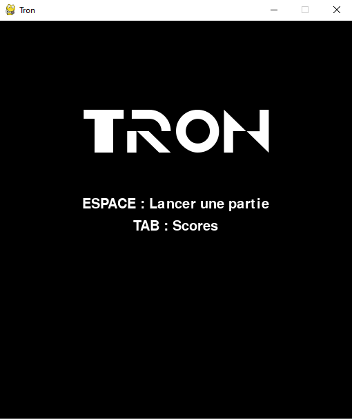

# Tron

Le Tron est le second petit jeu que j'ai développé en python.

Le programme utilise la bibliothèque pygame et requiert d'être dans le même répertoire que le dossier data pour être executé (en cas d'erreur avec le chemin des .png ou .ttf, le dossier data doit être mis dans le répertoire utilisateur).

Il se joue à deux, le joueur vert joue avec les touches E (haut), S (gauche), D (bas), F (droite); et le joueur blanc joue avec les touches flèches du haut/gauches/du bas/droite.
Pour lancer une partie on utilise la barre espace en étant sur le menu. Afin d'enregistrer une partie on saisi 3 caractères dans la console python lorsque cela est demandé. Pour consulter les parties enregistrer, on utilise la touche tabulation depuis l'acceuil, et échap pour en sortir.

# Accueil

# En partie

# Fin de partie

# Scores

Le système de score se base sur la durée d'une partie.
